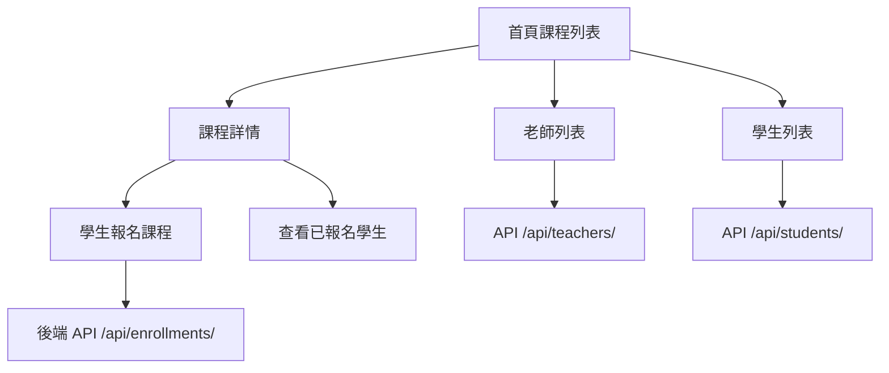

# 線上課程平台 Online Course Platform

## 專案簡介

這是一個 線上課程管理平台，提供學生與老師之間的課程管理與報名功能。
專案使用 Django + Django REST Framework 作為後端，前端使用 Django Templates + Tailwind CSS，並透過 Django Admin 管理資料。

## 核心價值

- 多對多關聯：課程可對應多位老師，老師可教授多門課程  
- 學生報名限制：同一課程僅能報名一次  
- 前後端整合：REST API + Django Templates  
- 前端美化：Tailwind CSS 卡片式 UI  
- 管理方便：Django Admin 完整管理資料

## 資料結構


### Teacher
| 欄位名稱 | 型別 | 說明 |
| --- | --- | --- |
| id | Integer | 主鍵，自動產生 |
| name | Char(100) | 老師姓名 |
| email | EmailField | 電子信箱，唯一 |
| bio | Text | 老師介紹，可選 |

### Student
| 欄位名稱 | 型別 | 說明 |
| --- | --- | --- |
| id | Integer | 主鍵，自動產生 |
| name | Char(100) | 學生姓名 |
| email | EmailField | 電子信箱，唯一 |
| level | Char(20) | 初級/中級/高級 |

### Course
| 欄位名稱 | 型別 | 說明 |
| --- | --- | --- |
| id | Integer | 主鍵，自動產生 |
| title | Char(200) | 課程名稱 |
| description | Text | 課程說明 |
| teachers | ManyToMany → Teacher | 多位授課老師 |
| created_at | DateTime | 課程建立時間 |

### Enrollment
| 欄位名稱 | 型別 | 說明 |
| --- | --- | --- |
| id | Integer | 主鍵，自動產生 |
| student | ForeignKey → Student | 報名學生 |
| course | ForeignKey → Course | 報名課程 |
| enrolled_at | DateTime | 報名時間 |

限制：學生對同一門課程只能報名一次

## API 功能

| 功能     | 方法   | 路徑                   | 說明            |
| ------ | ---- | -------------------- | ------------- |
| 課程列表   | GET  | /api/courses/        | 列出所有課程        |
| 單一課程   | GET  | /api/courses/課程id/   | 課程詳細資訊        |
| 新增課程   | POST | /api/courses/create/ | 新增課程（提供老師 ID） |
| 老師列表   | GET  | /api/teachers/       | 列出老師          |
| 新增老師   | POST | /api/teachers/       | 新增老師          |
| 學生列表   | GET  | /api/students/       | 列出學生          |
| 新增學生   | POST | /api/students/       | 新增學生          |
| 學生報名課程 | POST | /api/enrollments/    | 報名課程          |

## API JSON

1. 新增老師

```
{
  "name": "王老師",
  "email": "teacher_wang@example.com",
  "bio": "專長英文與文法教學"
}
```

2. 新增學生 

```
{
  "name": "小明",
  "email": "student_ming@example.com",
  "level": "初級"
}
```

3. 新增課程 

```
{
  "title": "英文入門",
  "description": "基礎文法與聽力練習",
  "teachers": [1, 2]
}

```

4. 學生報名課程 

```
{
  "student_id": 2,
  "course_id": 1
}
```

## 技術架構

後端
- Python 3
- Django 5：網站框架，處理前端 template、後端邏輯
- Django REST Framework (DRF)：提供 API 功能，JSON 資料傳輸
- SQLite：開發用資料庫
- Django Admin：後台管理老師、學生、課程資料

前端
- Django Templates：渲染 HTML 頁面
- Tailwind CSS：快速製作響應式 UI、卡片、表單
- HTML / CSS / JavaScript：前端基礎互動

其他
- CORS headers：允許前端與 API 跨域請求（開發階段使用）
- venv：Python 虛擬環境管理專案依賴

## 專案結構
```
202507-online-course/
├── manage.py
├── requirements.txt
├── db.sqlite3
├── project/
│ ├── settings.py
│ ├── urls.py
│ └── wsgi.py
├── courses/
│ ├── admin.py
│ ├── models.py
│ ├── views.py
│ ├── urls.py # HTML template 前端頁面路由
│ ├── api_urls.py # API 路由
│ ├── serializers.py
│ ├── migrations/
│ ├── templates/
│ │ ├── home.html
│ │ ├── course_list.html
│ │ ├── course_detail.html
│ │ ├── teacher_list.html
│ │ └── student_list.html
│ └── static/css/
└── README.md
```

## 安裝與啟動

1. Clone 專案

```
git clone https://github.com/tinachen0326/202507-online-course.git
cd 202507-online-course
```

2. 建立虛擬環境 & 安裝依賴

```
python -m venv venv
source venv/bin/activate     # Mac/Linux
venv\Scripts\activate        # Windows
pip install -r requirements.txt
```

3. 資料庫遷移

```
python manage.py makemigrations
python manage.py migrate
```

4. 建立 superuser（可選）

```
python manage.py createsuperuser
```

5. 啟動開發伺服器

```
python manage.py runserver
```


## 前端頁面示意
### 課程列表（Course List）


### 課程詳情（Course Detail）


### 老師列表（Teacher List）


### 學生列表（Student List）


### Django Admin 後臺管理資料


## 專案流程圖



## 前端網址：

- 課程列表：[http://127.0.0.1:8000/](http://127.0.0.1:8000/)
- 課程詳情：[http://127.0.0.1:8000/courses/課程id/](http://127.0.0.1:8000/courses/2/)
- 老師列表：[http://127.0.0.1:8000/teachers/](http://127.0.0.1:8000/teachers/)
- 學生列表：[http://127.0.0.1:8000/students/](http://127.0.0.1:8000/students/)
- Django Admin：[http://127.0.0.1:8000/admin/](http://127.0.0.1:8000/admin/)

## 使用方式

1. 在 Admin 新增老師與學生
2. 在課程列表查看課程資訊
3. 在課程詳情頁報名學生
4. 已報名學生不可重複報名同一課程
5. 老師與學生資料可透過 Admin 管理

## 版權聲明

此專案僅供個人學習參考使用，無授權用途。
